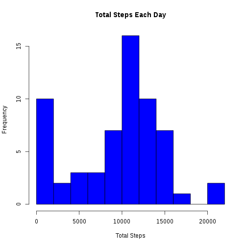
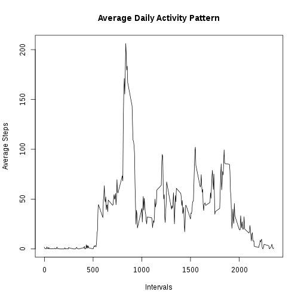
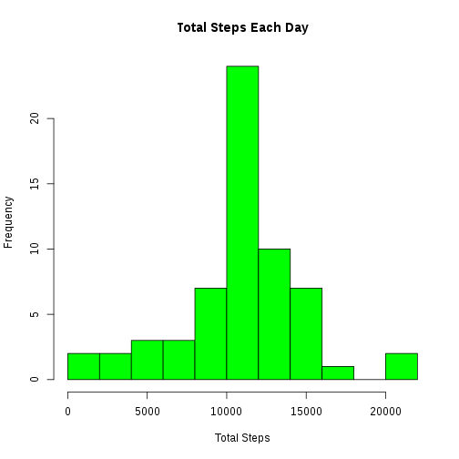

Activity Monitoring Data Analysis
======================================

### Loading and preprocessing the data

Use read.csv to load the data into R. Convert the date column to the Date class.


```r
act <- read.csv("activity.csv", stringsAsFactors = FALSE)
act$date <- as.Date(act$date, format = "%Y-%m-%d")
```

### What is the mean total number of steps taken per day?

1. Calculate total number of steps taken each day


```r
library(dplyr)
act <- group_by(act, date)
daytotal <- summarise(act, totalSteps = sum(steps, na.rm = TRUE))
```

2. Make a histogram of the total number of steps taken per day


```r
hist(daytotal$totalSteps, main = "Total Steps Each Day",  xlab = "Total Steps",
     col = "blue", breaks = 10)
```



3. Calculate the mean and median of the total number of steps taken per day


```r
median(daytotal$totalSteps)
```

```
## [1] 10395
```

```r
mean(daytotal$totalSteps)
```

```
## [1] 9354.23
```

### What is the average daily activity pattern?

1. Make a time series plot (i.e. type = "l") of the 5-minute interval (x-axis) 
and the average number of steps taken, averaged across all days (y-axis).


```r
act <- group_by(act, interval)
intervals <- summarise(act, AvgSteps = mean(steps, na.rm = TRUE))
with(intervals, plot(interval, AvgSteps, type = "l", xlab = "Intervals", 
    ylab = "Average Steps", main = "Average Daily Activity Pattern"))
```



2. Which 5-minute interval, on average across all the days in the dataset, 
contains the maximum number of steps?


```r
intervals[intervals$AvgSteps == max(intervals$AvgSteps), ]$interval
```

```
## [1] 835
```

### Imputing Missing Values

1. Calculate and report total number of missing values in the dataset


```r
missing <- is.na(act)
sum(missing)
```

```
## [1] 2304
```

2 & 3. Create a new dataset filling in missing values with the mean for that 
5-minute interval from the intervals data frame.


```r
act2 <- act
for (i in 1:17568) {
    if (is.na(act2[i, 1])) {
        iInt <- as.numeric(act2[i, 3])
        act2[i, 1] <- intervals[intervals$interval == iInt, ]$AvgSteps
    }
}
```

4. Make a histogram of the total number of steps taken each day:


```r
act2 <- group_by(act2, date)
daytotal2 <- summarise(act2, totalSteps = sum(steps))
hist(daytotal2$totalSteps, main = "Total Steps Each Day",  xlab = "Total Steps",
     col = "green", breaks = 10)
```



Calculate and report the mean and median total number of steps taken per day.


```r
median(daytotal2$totalSteps)
```

```
## [1] 10766.19
```

```r
mean(daytotal2$totalSteps)
```

```
## [1] 10766.19
```

Do these values differ from the estimates from the first part of the assignment?
What is the impact of imputing missing data on the estimates of the total 
daily number of steps?

    Yes, unlike the initial estimates, the mean and median here are the same.
    They are also both higher than the mean and median from the first part of
    the assignment. Imputing missing data increases the total daily number of
    steps.


### Are there differences in activity patterns between weekdays and weekends?

1. Create a new factor variable in the dataset with two levels ??? "weekday"
and "weekend" indicating whether a given date is a weekday or weekend day.


```r
days <- weekdays(act2$date)
for (j in 1:17568) {
    if(days[j] == "Saturday" | days[j] == "Sunday") {
        days[j] <- "weekend"
    }
    else {
        days[j] <- "weekday"
    }
}
act2 <- cbind.data.frame(act2, days)
```

2. Make a panel plot containing a time series plot (i.e. type = "l") of the 
5-minute interval (x-axis) and the average number of steps taken, averaged 
across all weekday days or weekend days (y-axis). See the README file in the 
GitHub repository to see an example of what this plot should look like using 
simulated data.

Analyze data:

```r
act2 <- group_by(act2, days, interval)
avgInt <- summarise(act2, AvgSteps = mean(steps))
```
Make plot:

```r
library(lattice)
xyplot(AvgSteps ~ interval | factor(days), avgInt, type = "l", 
       xlab = "Interval", ylab = "Number of steps")
```


